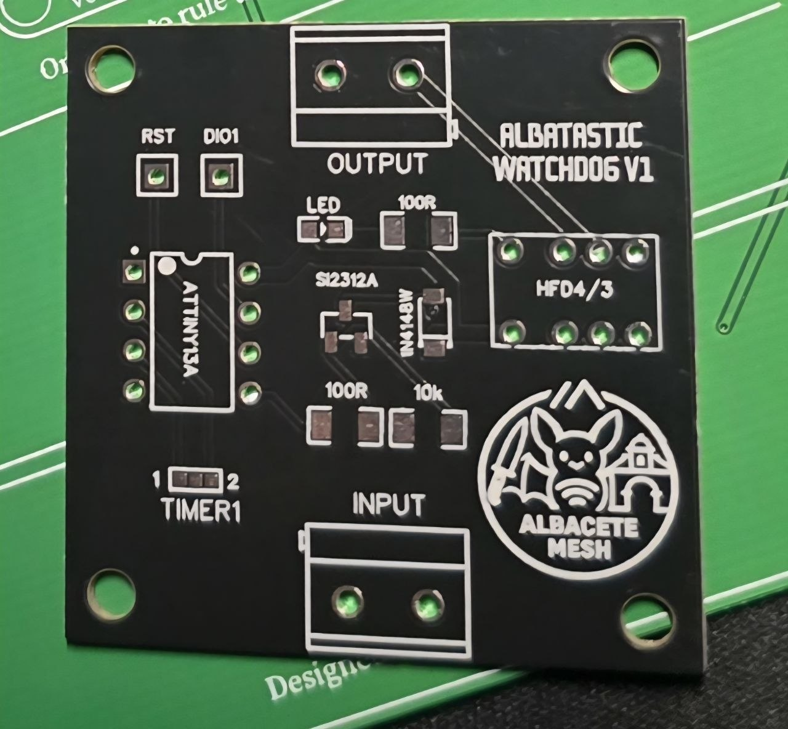

# Albatastic PRO Watchdog

# 🌍🇬🇧 [English version below](#-english-version)

> ⚖️ **Licencia: CC BY-NC 4.0 — Uso no comercial únicamente**  
> Este diseño es de libre uso y modificación, **pero queda prohibido cualquier uso comercial** sin autorización expresa del autor.

---

## Descripción

Sistema de watchdog inteligente para nodos Meshtastic basado en **ATtiny13A**. Diseñado para integrarse en la PCB **Albatastic PRO v1.2**, monitoriza la actividad del módulo de radio y ejecuta un reset automático si detecta que el nodo se ha colgado.

A diferencia de un watchdog por tiempo fijo, este sistema **detecta actividad real** en el bus del módulo de radio. Si el nodo sigue funcionando, nunca se resetea innecesariamente.

También está disponible como **módulo independiente** que puede añadirse a nodos Meshtastic ya existentes, sin necesidad de usar la PCB Albatastic PRO.

<div align="center">
  
</div>

---

## ¿Cómo funciona?

El ATtiny13A monitoriza el pin **DIO1 del módulo de radio** (SX1262 / LR1121). Este pin cambia de estado con cada operación de TX/RX. Si deja de cambiar durante demasiado tiempo, el nodo se considera bloqueado y el sistema actúa en **dos niveles**:

| Nivel | Condición | Acción |
|-------|-----------|--------|
| **Soft** | Sin actividad en DIO1 durante 6h | Pulso en pin RST del MCU |
| **Hard** | Sin recuperación tras reset suave (6h10m) | Corte de corriente via relé |
| **Preventivo** | Tiempo máximo configurable (12h/24h) | Reset suave aunque haya actividad |

> El reset preventivo puede desactivarse por software modificando `PREVENTIVO_ACTIVO`.

> 💡 **Nota sobre el tráfico de malla**: Debido al funcionamiento de la red Meshtastic, es raro que un nodo no reciba o retransmita algún mensaje en más de 6 horas si hay tráfico en la zona. Si el nodo va a estar en una ubicación con poco o ningún tráfico, se recomienda aumentar el tiempo de detección (`HORAS_SOFT_PRO`) para evitar resets innecesarios. Si todo funciona correctamente y hay tráfico en la red, el watchdog no debería saltar.

---

## Pinout ATtiny13A

```
                RST  1 ─┐   ┌─ 8  VCC (VBAT directo, LiPo 3.0–4.2V)
        OPCION2 PB3  2 ─┤   ├─ 7  PB2 ← DIO1 módulo radio (via 10kΩ)
        OPCION1 PB4  3 ─┤   ├─ 6  PB1 → RST MCU (reset SUAVE, via 100Ω)
                GND  4 ─┘   └─ 5  PB0 → Gate SI2312 (reset DURO, via 100Ω)
```

| Pin | Función |
|-----|---------|
| PB0 | Reset DURO → MOSFET SI2312 → Relé HFD4/3 → corte de corriente |
| PB1 | Reset SUAVE → pin RST del MCU |
| PB2 | Entrada watchdog ← DIO1 del módulo de radio |
| PB3 | Jumper OPCION2 |
| PB4 | Jumper OPCION1 (modo test si está soldado) |

---

## Hardware necesario

- **ATtiny13A** (DIP-8)
- **MOSFET SI2312** — N-Channel, controla la bobina del relé
- **Relé HFD4/3** — reed relay de baja corriente, corta la alimentación del nodo
- **Diodo 1N4148W** — en paralelo al relé, protección contra pico de tensión al desactivar
- **R1** 10kΩ — serie en DIO1, protección ante transitorios
- **R2** 100Ω — serie en gate SI2312
- **R3** 100Ω — serie en RST MCU

> ⚠️ El ATtiny13A se alimenta directamente desde LiPo (3.0–4.2V). El DIO1 del módulo de radio opera a 3.3V, compatible con el ATtiny en todo el rango de batería.

> Si no se desea usar el sistema watchdog, se puede **puentear mediante bypass soldado** en la PCB Albatastic PRO.

---

## Conexión

```
ATtiny PB0 → R 100Ω → Gate SI2312 → Relé HFD4/3 → Corte corriente (reset DURO)
ATtiny PB1 → R 100Ω → RST MCU                                       (reset SUAVE)
ATtiny PB2 ← R 10kΩ ← DIO1 módulo radio                             (watchdog)
ATtiny PB3 ← Jumper OPCION2
ATtiny PB4 ← Jumper OPCION1
```

---

## Configuración por jumpers

| OPCION1 | OPCION2 | Modo |
|---------|---------|------|
| Abierto | Abierto | Timeout preventivo 24h |
| Soldado | Abierto | Timeout preventivo 12h |
| Abierto | Soldado | Timeout preventivo 6h |
| Soldado | Soldado | **Test** — soft 40s / hard 64s |

---

## Características técnicas

- Consumo en sleep: **~0.11µA**
- Ciclo WDT interno: 8 segundos
- Detección por cambio de estado en DIO1 (PCINT)
- Parámetros configurables en cabecera del firmware
- Compatible con SX1262, LR1121 y cualquier radio con pin DIO activo

---

## Firmware

El firmware está escrito en C para ATtiny13A con avr-gcc (compatible con Arduino IDE + MicroCore).

Todos los tiempos y opciones se configuran al inicio del archivo:

```cpp
// --- Reset preventivo ---
#define PREVENTIVO_ACTIVO   true      // true = activo, false = desactivado
#define HORAS_PREVENTIVO    12        // Horas entre resets preventivos

// --- Tiempos watchdog ---
#define HORAS_SOFT_PRO      6         // Horas sin actividad → reset suave
#define MINUTOS_EXTRA_HARD  10        // Minutos extra tras soft → reset duro

// --- Tiempos modo test (OPCION1 soldado) ---
#define SEGUNDOS_SOFT_TEST  40        // Segundos sin actividad → reset suave
#define SEGUNDOS_HARD_TEST  64        // Segundos sin actividad → reset duro
```

---

## Integración con Albatastic PRO

Este watchdog está diseñado específicamente para la PCB **Albatastic PRO v1.2**.  
Más información sobre la PCB: [PCB-Albatastic-PRO](https://github.com/EmilioAL-Git/PCB-Albatastic-PRO)

---

## Autor

**Diseñado por**: [@Sremylio](https://telegram.me/sremylio) para MESHTASTIC ALBACETE

## 📜 Licencia

**Creative Commons Attribution–NonCommercial 4.0 International (CC BY-NC 4.0)**

Puedes usar, modificar y compartir este proyecto siempre que reconozcas al autor original y **no lo uses con fines comerciales**.

Más información: https://creativecommons.org/licenses/by-nc/4.0/

---
---

# 🇬🇧 ENGLISH VERSION

# Albatastic PRO Watchdog

> ⚖️ **License: CC BY-NC 4.0 — Non-commercial use only**  
> This design is free to use and modify, **but any commercial use is prohibited** without express authorization from the author.

---

## Description

Smart watchdog system for Meshtastic nodes based on the **ATtiny13A**. Designed to integrate with the **Albatastic PRO v1.2** PCB, it monitors radio module activity and triggers an automatic reset if the node is detected as frozen.

Unlike a fixed-timer watchdog, this system **detects real activity** on the radio module bus. As long as the node is working, it will never reset unnecessarily.

It is also available as a **standalone module** that can be added to existing Meshtastic nodes, without requiring the Albatastic PRO PCB.

<div align="center">
  
</div>

---

## How it works

The ATtiny13A monitors the **DIO1 pin of the radio module** (SX1262 / LR1121). This pin changes state with every TX/RX operation. If it stops changing for too long, the node is considered frozen and the system acts in **two levels**:

| Level | Condition | Action |
|-------|-----------|--------|
| **Soft** | No DIO1 activity for 6h | RST pulse on MCU reset pin |
| **Hard** | No recovery after soft reset (6h10m) | Power cut via relay |
| **Preventive** | Configurable max timeout (12h/24h) | Soft reset even if activity detected |

> The preventive reset can be disabled in software by setting `PREVENTIVO_ACTIVO` to `false`.

> 💡 **Note on mesh traffic**: Due to how the Meshtastic network works, it is unlikely that a node will go more than 6 hours without receiving or forwarding at least one message if there is traffic in the area. If the node is going to be deployed in a low or no traffic location, it is recommended to increase the detection time (`HORAS_SOFT_PRO`) to avoid unnecessary resets. If everything is working correctly and there is network traffic, the watchdog should never trigger.

---

## ATtiny13A Pinout

```
              RST  1 ─┐   ┌─ 8  VCC (direct VBAT, LiPo 3.0–4.2V)
        OPTION2 PB3  2 ─┤   ├─ 7  PB2 ← DIO1 radio module (via 10kΩ)
        OPTION1 PB4  3 ─┤   ├─ 6  PB1 → RST MCU (soft reset, via 100Ω)
              GND  4 ─┘   └─ 5  PB0 → Gate SI2312 (hard reset, via 100Ω)
```

| Pin | Function |
|-----|---------|
| PB0 | Hard reset → MOSFET SI2312 → Relay HFD4/3 → power cut |
| PB1 | Soft reset → MCU RST pin |
| PB2 | Watchdog input ← radio module DIO1 |
| PB3 | Jumper OPTION2 |
| PB4 | Jumper OPTION1 (test mode when bridged) |

---

## Required hardware

- **ATtiny13A** (DIP-8)
- **MOSFET SI2312** — N-Channel, drives the relay coil
- **Relay HFD4/3** — low-current reed relay, cuts node power supply
- **Diode 1N4148W** — in parallel with the relay, flyback protection when relay turns off
- **R1** 10kΩ — series on DIO1, transient protection
- **R2** 100Ω — series on SI2312 gate
- **R3** 100Ω — series on MCU RST

> ⚠️ The ATtiny13A is powered directly from LiPo (3.0–4.2V). The radio module's DIO1 operates at 3.3V, compatible with the ATtiny across the full battery range.

> If the watchdog system is not needed, it can be **bypassed with a solder bridge** on the Albatastic PRO PCB.

---

## Wiring

```
ATtiny PB0 → R 100Ω → Gate SI2312 → Relay HFD4/3 → Power cut  (hard reset)
ATtiny PB1 → R 100Ω → MCU RST                                  (soft reset)
ATtiny PB2 ← R 10kΩ ← Radio module DIO1                        (watchdog)
ATtiny PB3 ← Jumper OPTION2
ATtiny PB4 ← Jumper OPTION1
```

---

## Jumper configuration

| OPTION1 | OPTION2 | Mode |
|---------|---------|------|
| Open | Open | Preventive timeout 24h |
| Bridged | Open | Preventive timeout 12h |
| Open | Bridged | Preventive timeout 6h |
| Bridged | Bridged | **Test** — soft 40s / hard 64s |

---

## Technical specs

- Sleep current: **~0.11µA**
- Internal WDT cycle: 8 seconds
- Detection via DIO1 state change (PCINT)
- All parameters configurable at top of firmware file
- Compatible with SX1262, LR1121 and any radio with an active DIO pin

---

## Firmware

Written in C for ATtiny13A with avr-gcc (compatible with Arduino IDE + MicroCore).

All timings and options are configured at the top of the file:

```cpp
// --- Preventive reset ---
#define PREVENTIVO_ACTIVO   true      // true = enabled, false = disabled
#define HORAS_PREVENTIVO    12        // Hours between preventive resets

// --- Watchdog timings ---
#define HORAS_SOFT_PRO      6         // Hours without activity → soft reset
#define MINUTOS_EXTRA_HARD  10        // Extra minutes after soft → hard reset

// --- Test mode timings (OPTION1 bridged) ---
#define SEGUNDOS_SOFT_TEST  40        // Seconds without activity → soft reset
#define SEGUNDOS_HARD_TEST  64        // Seconds without activity → hard reset
```

---

## Integration with Albatastic PRO

This watchdog is specifically designed for the **Albatastic PRO v1.2** PCB.  
More information about the PCB: [PCB-Albatastic-PRO](https://github.com/EmilioAL-Git/PCB-Albatastic-PRO)

---

## Author

**Designed by**: [@Sremylio](https://telegram.me/sremylio) for MESHTASTIC ALBACETE

## 📜 License

**Creative Commons Attribution–NonCommercial 4.0 International (CC BY-NC 4.0)**

You may use, modify and share this project as long as you credit the original author and **do not use it for commercial purposes**.

More information: https://creativecommons.org/licenses/by-nc/4.0/
